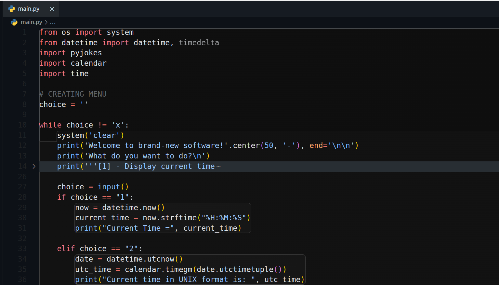

# First group project
Team project for DCI.

## What this program can do?

+ Display current time
+ Display current time in UNIX format
+ Convert data to datetime format
+ Calculate the time from today to some future date
+ Show the delta
+ Display calendar for certain month
+ Is current year leap?
+ How much time to next leap year?
+ Random joke
+ Real-time clock

## Code

## Requirements: 

+ `datetime`, `timedelta`
+ `calender`
+ `os`
+ `pyjokes`
